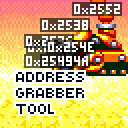

# 💻 Address Grabber Tool

Tool for modders to get addresses and indexes of dynamic game objects.

## 🔎 How to use

Just download the mod and enable **Address Grabber Tool** in AIR.

Use the [Y] button to switch between Renderhooks, VDP sprites and Compounds.

We also have several options for displaying addresses:  
\* Always on - Addresses and indexes will be shown everywhere and always while the mod is enabled.  
\* Only with Debug - Addresses and indexes will be shown only when Debug Mode is enabled.

## ⁉️ FAQ:

**Q. I noticed a bug, where can I contact?**  
A. Contact me in the comments of Gamebanana, GitHub issues, or via Discord on the Sonic 3 A.I.R Community server. Try to describe the problem in more detail.